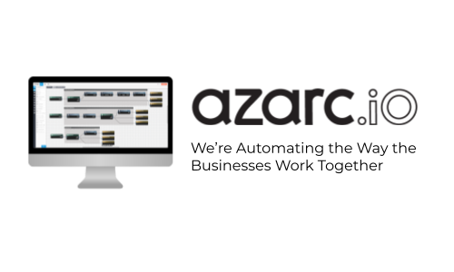

<!-- Improved compatibility of back to top link: See: https://github.com/othneildrew/Best-README-Template/pull/73 -->

<a name="readme-top"></a>

<!--
*** Thanks for checking out the Best-README-Template. If you have a suggestion
*** that would make this better, please fork the repo and create a pull request
*** or simply open an issue with the tag "enhancement".
*** Don't forget to give the project a star!
*** Thanks again! Now go create something AMAZING! :D
-->

<!-- PROJECT SHIELDS -->
<!--
*** I'm using markdown "reference style" links for readability.
*** Reference links are enclosed in brackets [ ] instead of parentheses ( ).
*** See the bottom of this document for the declaration of the reference variables
*** for contributors-url, forks-url, etc. This is an optional, concise syntax you may use.
*** https://www.markdownguide.org/basic-syntax/#reference-style-links
-->

[![Contributors][contributors-shield]][contributors-url]
[![Forks][forks-shield]][forks-url]
[![Stargazers][stars-shield]][stars-url]
[![Issues][issues-shield]][issues-url]
[![MIT License][license-shield]][license-url]
[![LinkedIn][linkedin-shield]][linkedin-url]

<!-- PROJECT LOGO -->
<br />
<div align="center">
  <a href="https://github.com/owezzy/azarc">
    
  </a>

<h3 align="center">Employees Management</h3>

  <p align="center">
    project_description
    <br />
    <a href="https://github.com/owezzy/azarc"><strong>Explore the docs »</strong></a>
    <br />
    <br />
    <a href="https://main.d2d8hegiknd97j.amplifyapp.com/">View Demo</a>
    ·
    <a href="https://github.com/owezzy/azarc/issues">Report Bug</a>
    ·
    <a href="https://github.com/owezzy/azarc/issues">Request Feature</a>
  </p>
</div>

<!-- TABLE OF CONTENTS -->
<details>
  <summary>Table of Contents</summary>
  <ol>
    <li>
      <a href="#about-the-project">About The Project</a>
      <ul>
        <li><a href="#built-with">Built With</a></li>
      </ul>
    </li>
    <li>
      <a href="#getting-started">Getting Started</a>
      <ul>
        <li><a href="#prerequisites">Prerequisites</a></li>
        <li><a href="#installation">Installation</a></li>
      </ul>
    </li>
    <li><a href="#usage">Usage</a></li>
    <li><a href="#roadmap">Roadmap</a></li>
    <li><a href="#contributing">Contributing</a></li>
    <li><a href="#license">License</a></li>
    <li><a href="#contact">Contact</a></li>
    <li><a href="#acknowledgments">Acknowledgments</a></li>
  </ol>
</details>

<!-- ABOUT THE PROJECT -->

## About The Project

[![Product Name Screen Shot][product-screenshot]](https://main.d2d8hegiknd97j.amplifyapp.com/#/)

Azarc needs a way to manage employees and their personal details. The requirements are simple

1.  As an employee at Azarc, I should be able to log in with my google OAuth Account
2.  As a logged in user I should see a searchable directory of employees
3.  As a logged in user I should be able to navigate to my profile and add my personal details
4.  Residential Address
5.  Work office location
6.  Los Angeles
7.  Cape Town
8.  London
<p align="right">(<a href="#readme-top">back to top</a>)</p>

### Built With

- [![Angular][angular.io]][angular-url]

<p align="right">(<a href="#readme-top">back to top</a>)</p>

<!-- GETTING STARTED -->

## Getting Started

We first need to install the project dependencies:

### Prerequisites

Make sure you have node v14 and above use [NVM](https://github.com/nvm-sh/nvm) to install and manage different versions of node.

### Installation

```bash
npm install
```

<p align="right">(<a href="#readme-top">back to top</a>)</p>

<!-- USAGE EXAMPLES -->

## Usage

```bash
npm start
```

> Visit `http://localhost:4200/`

login Page
[![Product Name Screen Shot][product-screenshot-1]](https://main.d2d8hegiknd97j.amplifyapp.com/#/)

app Home Page
[![Product Name Screen Shot][product-screenshot-2]](https://main.d2d8hegiknd97j.amplifyapp.com/#/)

app profile page
[![Product Name Screen Shot][product-screenshot-3]](https://main.d2d8hegiknd97j.amplifyapp.com/#/)

Amplify Console
[![Product Name Screen Shot][product-screenshot-4]](https://main.d2d8hegiknd97j.amplifyapp.com/#/)

<p align="right">(<a href="#readme-top">back to top</a>)</p>

<!-- ROADMAP -->

## Roadmap

- [x] Profile Page
- [x] Employess Page
- [x] AuthO authentication
- [x] Cypress e2e tests
- [x] AWS Amplify with CI-CD

See the [open issues](https://github.com/owezzy/azarc/issues) for a full list of proposed features (and known issues).

<p align="right">(<a href="#readme-top">back to top</a>)</p>

<!-- CONTRIBUTING -->

## Contributing

Contributions are what make the open source community such an amazing place to learn, inspire, and create. Any contributions you make are **greatly appreciated**.

If you have a suggestion that would make this better, please fork the repo and create a pull request. You can also simply open an issue with the tag "enhancement".
Don't forget to give the project a star! Thanks again!

1. Fork the Project
2. Create your Feature Branch (`git checkout -b ft-AmazingFeature`)
3. Commit your Changes (`git commit -m 'Add some AmazingFeature'`)
4. Push to the Branch (`git push origin ft-AmazingFeature`)
5. Open a Pull Request

<!-- LICENSE -->

## License

Distributed under the MIT License. See `LICENSE.txt` for more information.

<p align="right">(<a href="#readme-top">back to top</a>)</p>

<!-- CONTACT -->

## Contact

Your Name - [@owen_adira](https://twitter.com/owen_adira) - owenadira@gmail.com
Project Link: [https://github.com/owezzy/azarc](https://github.com/owezzy/azarc)

<p align="right">(<a href="#readme-top">back to top</a>)</p>

<!-- ACKNOWLEDGMENTS -->

## Acknowledgments

- []()
- []()
- []()

<p align="right">(<a href="#readme-top">back to top</a>)</p>

<!-- MARKDOWN LINKS & IMAGES -->
<!-- https://www.markdownguide.org/basic-syntax/#reference-style-links -->

[contributors-shield]: https://img.shields.io/github/contributors/owezzy/azarc.svg?style=for-the-badge
[contributors-url]: https://github.com/owezzy/azarc/graphs/contributors
[forks-shield]: https://img.shields.io/github/forks/owezzy/azarc.svg?style=for-the-badge
[forks-url]: https://github.com/owezzy/azarc/network/members
[stars-shield]: https://img.shields.io/github/stars/owezzy/azarc.svg?style=for-the-badge
[stars-url]: https://github.com/owezzy/azarc/stargazers
[issues-shield]: https://img.shields.io/github/issues/owezzy/azarc.svg?style=for-the-badge
[issues-url]: https://github.com/owezzy/azarc/issues
[license-shield]: https://img.shields.io/github/license/owezzy/azarc.svg?style=for-the-badge
[license-url]: https://github.com/owezzy/azarc/blob/master/LICENSE
[linkedin-shield]: https://img.shields.io/badge/-LinkedIn-black.svg?style=for-the-badge&logo=linkedin&colorB=555
[linkedin-url]: https://linkedin.com/in/owezzy
[product-screenshot]: src/assets/screenshots/employees_data_table.png
[product-screenshot-1]: src/assets/screenshots/login.png
[product-screenshot-2]: src/assets/screenshots/employees_page.png
[product-screenshot-3]: src/assets/screenshots/profile.png
[product-screenshot-4]: src/assets/screenshots/amplify_CI_CD.png
[angular.io]: https://img.shields.io/badge/Angular-DD0031?style=for-the-badge&logo=angular&logoColor=white
[angular-url]: https://angular.io/
